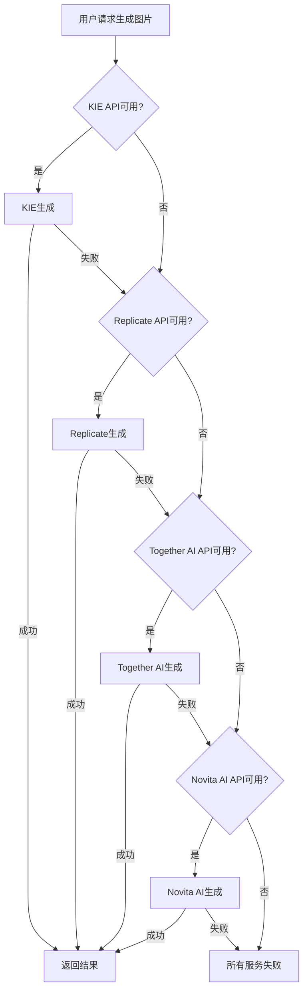

# 信息图生成多提供商托底配置指南

## 📖 概述

为了解决KIE服务不稳定的问题（生成4张经常只出来2张），我们实现了多提供商自动降级托底机制。

### 🎯 降级策略

```
KIE (主服务) → Replicate (托底1) → Together AI (托底2) → Novita AI (托底3)
```

当前面的服务失败时，自动切换到下一个服务，大大提高生成成功率。

## 💰 价格对比

| 提供商 | 价格/张 | 推荐度 | 备注 |
|--------|---------|--------|------|
| **FAL** | $0.05-0.10 | ❌ | 太贵，不推荐 |
| **KIE** | $0.02-0.05 | ⭐⭐⭐ | 专业信息图模型 |
| **Replicate** | $0.003-0.03 | ⭐⭐⭐⭐⭐ | 稳定可靠，推荐 |
| **Together AI** | $0.002-0.008 | ⭐⭐⭐⭐⭐ | 又快又便宜，强烈推荐 |
| **Novita AI** | $0.001-0.005 | ⭐⭐⭐⭐ | 最便宜 |

## 📐 分辨率支持对比

| 提供商 | 1K | 2K | 4K |
|--------|----|----|-----|
| **KIE nano-banana-pro** | ✅ | ✅ | ❌ |
| **Replicate FLUX** | ✅ | ✅ | ✅ |
| **Together AI FLUX** | ✅ | ✅ (最大1440px) | ❌ 自动降级到2K |
| **Novita AI FLUX** | ✅ | ✅ (最大2048px) | ❌ 自动降级到2K |

### ❓ 关于OpenRouter

**OpenRouter不适合做图片生成托底**，原因：
- 主要是LLM聚合平台（文本生成），不是专业图片生成平台
- 图片生成模型极少，选择有限
- 不支持分辨率控制（无法指定1K、2K、4K）
- 价格不一定便宜，通常也是转发到Replicate等服务

## 🛠️ 环境变量配置

在您的 `.env.development` 或 `.env.production` 文件中添加：

```bash
# ========================================
# AI图片生成服务配置
# ========================================

# KIE API - 主要服务
KIE_NANO_BANANA_PRO_KEY=your_kie_api_key_here

# Replicate API - 托底服务1（推荐）
REPLICATE_API_TOKEN=r8_your_replicate_token_here

# Together AI API - 托底服务2（推荐）
TOGETHER_API_KEY=your_together_api_key_here

# Novita AI API - 托底服务3（最便宜）
NOVITA_API_KEY=your_novita_api_key_here
```

### API Key 获取地址

1. **KIE**: https://kie.ai/
2. **Replicate**: https://replicate.com/account/api-tokens
3. **Together AI**: https://together.ai/
4. **Novita AI**: https://novita.ai/

## 📝 推荐配置方案

### 方案1：KIE + Replicate + Together AI（推荐⭐⭐⭐⭐⭐）

```bash
KIE_NANO_BANANA_PRO_KEY=xxx
REPLICATE_API_TOKEN=r8_xxx
TOGETHER_API_KEY=xxx
```

**优点：**
- ✅ 成本：中等
- ✅ 可靠性：极高
- ✅ 支持4K：是（通过Replicate）
- ✅ 速度：快

### 方案2：KIE + Together AI + Novita AI（高性价比⭐⭐⭐⭐）

```bash
KIE_NANO_BANANA_PRO_KEY=xxx
TOGETHER_API_KEY=xxx
NOVITA_API_KEY=xxx
```

**优点：**
- ✅ 成本：低
- ✅ 可靠性：高
- ❌ 支持4K：否（最大2K）
- ✅ 速度：快

### 方案3：Together AI + Novita AI（最便宜⭐⭐⭐）

```bash
TOGETHER_API_KEY=xxx
NOVITA_API_KEY=xxx
```

**优点：**
- ✅ 成本：最低
- ⚠️ 可靠性：中（没有KIE专业信息图模型）
- ❌ 支持4K：否（最大2K）
- ✅ 速度：最快

## 🔄 使用方法

### 1. 使用新的托底API（推荐）

前端调用新的API端点：

```typescript
// 生成图片（带自动降级）
const response = await fetch('/api/infographic/generate-with-fallback', {
  method: 'POST',
  headers: { 'Content-Type': 'application/json' },
  body: JSON.stringify({
    content: '你的文本内容',
    aspectRatio: '16:9',
    resolution: '2K',
    outputFormat: 'png',
  }),
});

const data = await response.json();
// data包含：
// - success: 是否成功
// - taskId: 任务ID
// - imageUrls: 图片URL数组（如果是同步API）
// - provider: 使用的提供商名称
// - fallbackUsed: 是否使用了托底服务
```

### 2. 查询任务状态

```typescript
// 查询任务状态（支持所有提供商）
const response = await fetch(
  `/api/infographic/query-with-fallback?taskId=${taskId}&provider=${provider}`
);

const data = await response.json();
// data包含：
// - success: 是否成功
// - status: 'SUCCESS' | 'PENDING' | 'FAILED'
// - results: 图片URL数组
```

### 3. 在管理后台配置

1. 访问 `/admin/settings`
2. 切换到 `AI` 标签页
3. 找到以下配置组：
   - **KIE** - 填入KIE API Key
   - **Replicate** - 填入Replicate API Token
   - **Together AI** - 填入Together AI API Key
   - **Novita AI** - 填入Novita AI API Key
4. 保存配置

## 📊 工作原理



## 📈 预期效果

配置多提供商托底后：

| 配置方案 | 预期成功率 | 备注 |
|---------|-----------|------|
| **只用KIE** | 50-70% | 当前情况（不稳定） |
| **KIE + Replicate** | 95%+ | 推荐基础配置 |
| **KIE + Replicate + Together AI** | 99%+ | 推荐最佳配置 |
| **全部配置** | 99.9%+ | 最高可靠性 |

## 🚀 代码文件说明

### 新增文件

1. **src/extensions/ai/together.ts** - Together AI Provider实现
2. **src/extensions/ai/novita.ts** - Novita AI Provider实现
3. **src/app/api/infographic/generate-with-fallback/route.ts** - 带托底的生成API
4. **src/app/api/infographic/query-with-fallback/route.ts** - 带托底的查询API

### 修改文件

1. **src/extensions/ai/index.ts** - 导出新的Provider
2. **src/shared/services/ai.ts** - 注册新的Provider到AIManager
3. **src/shared/services/settings.ts** - 添加新的配置项

## ⚠️ 注意事项

1. **至少配置一个提供商**：没有配置任何API Key时，功能将不可用
2. **环境变量优先**：如果同时在数据库和环境变量中配置，环境变量优先
3. **成本控制**：虽然托底服务价格便宜，但仍建议监控使用量
4. **分辨率限制**：如果需要4K分辨率，必须配置Replicate
5. **异步vs同步**：
   - KIE、Novita：异步API，需要轮询查询结果
   - Replicate、Together AI：同步API，直接返回结果

## 🔧 故障排查

### 问题1：所有服务都失败

**检查：**
1. 确认至少配置了一个API Key
2. 检查API Key是否正确
3. 检查API余额是否充足
4. 查看服务器日志了解具体错误

### 问题2：只有KIE工作，托底服务不生效

**检查：**
1. 确认环境变量或数据库配置中有托底服务的API Key
2. 重启服务器使环境变量生效
3. 检查托底服务的API Key格式是否正确

### 问题3：生成速度变慢

**原因：**托底机制需要依次尝试多个服务，如果前面的服务都失败才会变慢

**解决：**
1. 将最稳定的服务配置为主服务
2. 移除不稳定的服务
3. 优化超时时间设置

## 📞 技术支持

如果遇到问题，请查看：
1. 服务器日志（包含详细的错误信息）
2. 浏览器控制台（查看前端错误）
3. 各个API提供商的状态页面

祝您使用愉快！🎉

