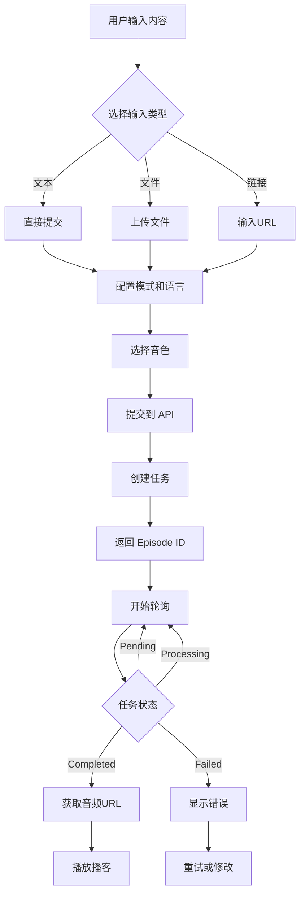

# ListenHub 播客功能集成指南

## 📋 概述

本文档详细说明了如何在 StudyHacks 项目中集成 ListenHub AI 播客生成功能。

## 🎯 功能特点

### 支持的播客模式
1. **速听模式 (Quick)** - 1-2分钟，快速生成，适合新闻快报
2. **深度模式 (Deep)** - 2-4分钟，内容质量高，适合专业知识分享
3. **辩论模式 (Debate)** - 2-4分钟，双主持人辩论形式，适合观点讨论

### 支持的输入方式
- ✅ 文本输入：直接粘贴或输入文本内容
- ✅ 文件上传：支持 PDF, TXT, DOCX, EPUB, MD, JPG, JPEG, PNG, WEBP
- ✅ 链接输入：支持 YouTube, Bilibili, Twitter, Medium, Reddit, 知乎等平台

### 多语言支持
- 自动检测
- 中文、英文、日语、韩语、西班牙语、法语、德语

### 音色配置
- 单人播客：选择一个音色
- 双人播客：选择两个音色（适用于辩论模式）
- 支持自定义克隆音色

## 🚀 快速开始

### 1. 获取 ListenHub API Key

1. 访问 [ListenHub](https://listenhub.ai/zh/app/home)
2. 注册/登录账号
3. 进入设置页面：https://listenhub.ai/zh/app/settings/apikey
4. 创建新的 API Key 并复制

### 2. 配置环境变量

在项目根目录创建或编辑 `.env.local` 文件：

```bash
# ===== ListenHub Podcast 配置 =====
LISTENHUB_ENABLED=true
LISTENHUB_API_KEY=your_listenhub_api_key_here
LISTENHUB_BASE_URL=https://api.listenhub.ai
```

**重要提示：**
- 将 `your_listenhub_api_key_here` 替换为你的实际 API Key
- 不要将 `.env.local` 文件提交到 Git 仓库
- API Key 只在服务器端使用，前端永远看不到

### 3. 安装依赖（如果需要）

项目已包含所有必要的依赖，无需额外安装。

### 4. 启动开发服务器

```bash
pnpm dev
```

### 5. 访问播客页面

打开浏览器访问：http://localhost:3000/zh/podcast

## 📁 项目结构

```
src/
├── extensions/ai/
│   ├── listenhub.ts              # ListenHub AI Provider
│   └── index.ts                  # AI Provider 导出
├── app/
│   ├── api/ai/podcast/
│   │   └── route.ts              # 播客 API 路由
│   └── [locale]/(landing)/podcast/
│       └── page.tsx              # 播客前端页面
├── config/
│   ├── index.ts                  # 环境变量配置
│   └── locale/messages/
│       ├── zh/podcast.json       # 中文翻译
│       └── en/podcast.json       # 英文翻译
```

## 🔧 技术实现

### 1. ListenHub Provider (`src/extensions/ai/listenhub.ts`)

**核心功能：**
- 与 ListenHub API 通信
- 支持异步任务生成和查询
- 处理多种输入类型（文本、文件、链接）
- 支持多种播客模式和语言

**主要方法：**
```typescript
// 生成播客
async generate({ params }): Promise<AITaskResult>

// 查询任务状态
async query({ taskId }): Promise<AITaskResult>

// 获取支持的模式
static getSupportedModes()

// 获取支持的语言
static getSupportedLanguages()
```

### 2. API 路由 (`src/app/api/ai/podcast/route.ts`)

**POST /api/ai/podcast** - 生成播客
```typescript
{
  mode: 'quick' | 'deep' | 'debate',
  language?: string,
  voices?: {
    speaker_1: string,
    speaker_2?: string
  },
  content?: string,      // 文本内容
  file_url?: string,     // 文件URL
  link?: string          // 网页链接
}
```

**GET /api/ai/podcast?episodeId=xxx** - 查询播客状态
```typescript
{
  success: boolean,
  taskId: string,
  taskStatus: 'pending' | 'processing' | 'success' | 'failed',
  taskInfo: {...},
  taskResult: {
    audioUrl?: string,
    duration?: number,
    transcript?: string
  }
}
```

### 3. 前端页面 (`src/app/[locale]/(landing)/podcast/page.tsx`)

**主要功能：**
- 模式选择（速听/深度/辩论）
- 输入方式切换（文本/文件/链接）
- 语言和音色配置
- 实时播放器
- 播客库管理
- 轮询查询任务状态

**状态管理：**
- 使用 React Hooks 管理组件状态
- 自动轮询查询播客生成状态（每5秒）
- 支持播放、暂停、进度控制、音量调节

## 💰 积分消耗

不同模式消耗不同积分：
- **速听模式 (Quick)**: 5 积分
- **深度模式 (Deep)**: 8 积分
- **辩论模式 (Debate)**: 10 积分

## 🔐 安全性

1. **API Key 保护**
   - API Key 只存储在服务器端环境变量中
   - 前端通过 API 路由调用，不直接暴露 API Key

2. **用户认证**
   - 所有 API 请求都需要用户登录
   - 自动验证用户积分余额

3. **输入验证**
   - 文件类型和大小验证（最大 10MB）
   - URL 格式验证
   - 必填参数验证

## 📊 API 参考

### ListenHub API 文档
- 官方文档：https://blog.listenhub.ai/openapi-docs
- API 端点：https://api.listenhub.ai

### 主要端点

**生成播客：**
```
POST https://api.listenhub.ai/v1/podcast/episodes
```

**查询状态：**
```
GET https://api.listenhub.ai/v1/podcast/episodes/{episode_id}
```

## 🐛 常见问题

### 1. API Key 未配置
**错误信息：** "ListenHub API key is not configured"

**解决方案：**
- 检查 `.env.local` 文件中是否正确配置了 `LISTENHUB_API_KEY`
- 确保环境变量已正确加载（重启开发服务器）

### 2. 积分不足
**错误信息：** "Insufficient credits"

**解决方案：**
- 前往设置页面充值积分
- 或使用邀请码获取免费积分

### 3. 文件上传失败
**错误信息：** "Unsupported file format" 或 "File too large"

**解决方案：**
- 确保文件格式在支持列表中
- 确保文件大小不超过 10MB

### 4. 播客生成失败
**错误信息：** "Podcast generation failed"

**可能原因：**
- 内容格式不符合要求
- 链接无法访问
- ListenHub API 服务异常

**解决方案：**
- 检查输入内容的格式和质量
- 确认链接可以正常访问
- 稍后重试

## 🔄 工作流程



## 📝 使用示例

### 示例 1：从文本生成播客

```typescript
// 1. 用户输入文本
const textContent = "人工智能的发展历程...";

// 2. 选择模式和语言
const mode = "deep";
const language = "zh";

// 3. 选择音色
const voices = {
  speaker_1: "voice_1"
};

// 4. 调用 API
const response = await fetch('/api/ai/podcast', {
  method: 'POST',
  headers: { 'Content-Type': 'application/json' },
  body: JSON.stringify({
    mode,
    language,
    voices,
    content: textContent
  })
});

// 5. 获取任务ID并轮询
const { episodeId } = await response.json();
// 开始轮询查询状态...
```

### 示例 2：从链接生成播客

```typescript
// 1. 用户输入链接
const link = "https://www.youtube.com/watch?v=xxxxx";

// 2. 选择辩论模式（双人）
const mode = "debate";
const voices = {
  speaker_1: "voice_1",
  speaker_2: "voice_2"
};

// 3. 调用 API
const response = await fetch('/api/ai/podcast', {
  method: 'POST',
  headers: { 'Content-Type': 'application/json' },
  body: JSON.stringify({
    mode,
    language: "auto",
    voices,
    link
  })
});
```

## 🎨 UI 组件

### 模式选择卡片
- 显示模式名称、描述、时长和积分消耗
- 支持点击切换
- 高亮显示当前选中模式

### 输入区域
- 三种输入方式切换（文本/文件/链接）
- 文件拖拽上传支持
- 显示支持的平台Logo

### 播放器
- 进度条拖动
- 播放/暂停控制
- 音量调节
- 下载和分享功能

### 播客库
- 显示历史生成的播客
- 支持点击播放
- 显示播客信息（时长、模式等）

## 🚀 部署到生产环境

### Vercel 部署

1. 在 Vercel 项目设置中添加环境变量：
   ```
   LISTENHUB_ENABLED=true
   LISTENHUB_API_KEY=your_production_api_key
   LISTENHUB_BASE_URL=https://api.listenhub.ai
   ```

2. 推送代码到 Git 仓库

3. Vercel 会自动部署

### 其他平台

确保在部署平台的环境变量配置中添加上述三个环境变量。

## 📚 参考资源

- [ListenHub 官网](https://listenhub.ai)
- [ListenHub API 文档](https://blog.listenhub.ai/openapi-docs)
- [项目 GitHub](https://github.com/your-repo)

## 🤝 贡献

如果你发现任何问题或有改进建议，欢迎提交 Issue 或 Pull Request。

## 📄 许可证

本项目遵循 MIT 许可证。

---

**最后更新：** 2025-12-31
**版本：** 1.0.0

